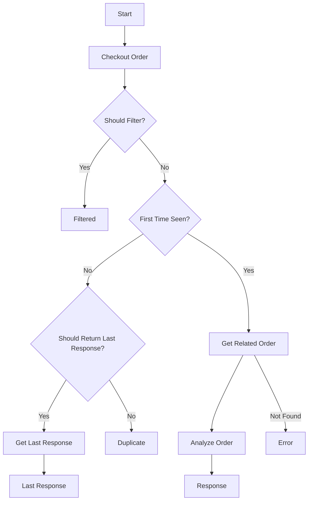

```mermaid

graph TD
    A[Start] --> B[Checkout Order]
    B --> C{Should Filter?}
    C -->|Yes| D[Filtered]
    C -->|No| E{First Time Seen?}
    E -->|No| F{Should Return Last Response?}
    F -->|Yes| G[Get Last Response]
    G --> H[Last Response]
    F -->|No| I[Duplicate]
    E -->|Yes| J[Get Related Order]
    J --> K[Analyze Order]
    K --> L[Response]
    J -->|Not Found| M[Error]
```
