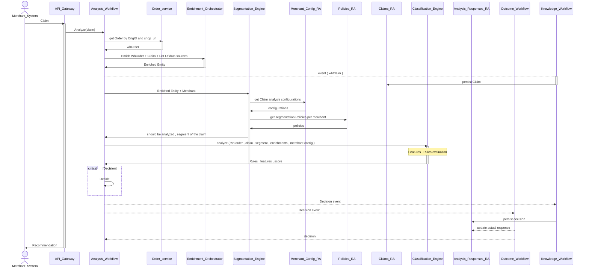

```mermaid
sequenceDiagram
actor Merchant_System
participant API_Gateway
participant Analysis_Workflow
participant Order_service
participant Enrichment_Orchestrator
participant Segmantation_Engine
participant Merchant_Config_RA
participant Policies_RA
participant Claims_RA
participant Classification_Engine
participant Analysis_Responses_RA
participant Outcome_Workflow
participant Knowledge_Workflow 


Merchant_System->>API_Gateway: Claim
activate API_Gateway
API_Gateway ->> Analysis_Workflow: Analyze(claim)

Analysis_Workflow ->> Order_service: get Order by OrigID and shop_url
activate Order_service
Order_service ->> Analysis_Workflow: whOrder
deactivate Order_service

Analysis_Workflow ->> Enrichment_Orchestrator: Enrich WhOrder + Claim + List Of data sources
activate Enrichment_Orchestrator

Enrichment_Orchestrator ->> Analysis_Workflow: Enriched Entity
deactivate Enrichment_Orchestrator

Analysis_Workflow --> Knowledge_Workflow: event ( whClaim )
activate Knowledge_Workflow
Knowledge_Workflow ->> Claims_RA: persist Claim
deactivate Knowledge_Workflow

Analysis_Workflow ->> Segmantation_Engine: Enriched Entity + Merchant 
activate Segmantation_Engine
Segmantation_Engine ->> Merchant_Config_RA: get Claim analysis configurations
Merchant_Config_RA ->> Segmantation_Engine: configurations

Segmantation_Engine ->> Policies_RA: get segmentation Policies per merchant
Policies_RA ->> Segmantation_Engine: policies

Segmantation_Engine ->> Analysis_Workflow: should be analyzed , segment of the claim

Analysis_Workflow ->> Classification_Engine: analyze ( wh order , claim , segment , enrichments , merchant config )
activate Classification_Engine
Note over Classification_Engine: Features , Rules evaluation

Classification_Engine ->> Analysis_Workflow: Rules , features , score
deactivate Classification_Engine

deactivate Segmantation_Engine

critical Decision
    Analysis_Workflow ->> Analysis_Workflow: Decide
end 

Analysis_Workflow -->> Knowledge_Workflow: Decision event
Analysis_Workflow -->> Outcome_Workflow: Decision event
Knowledge_Workflow ->> Analysis_Responses_RA: persist decision

Outcome_Workflow -->> Analysis_Responses_RA: update actual response

Outcome_Workflow -->> Analysis_Workflow: decision

API_Gateway ->> Merchant_System: Recommendation

deactivate API_Gateway


```
